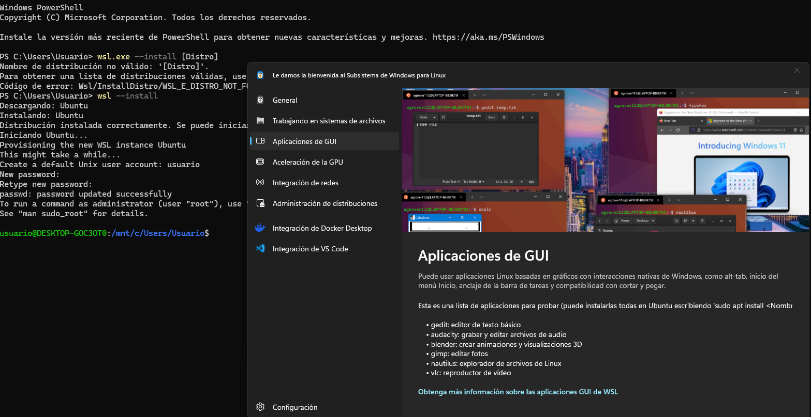

# Entorno y Linux

<p align="center">
  
</p>

***

## ¿Que tendremos que hacer ?
- 1 Parte: Instalación Máquina virtual
- 2 Parte: Instalación de WSL

***
## 1 Parte: Instalación Máquina virtual

Instalación Máquina virtual :

*Descarga Virtual Box* 

*Descarga una imagen actual de Ubuntu*

*Instala Docker*

*Instala SSH y abre el puerto 22 para que puedas acceder desde tu PC*

***

# Guía Rápida: Docker y SSH en Ubuntu

### 1. Actualizar sistema

```bash
sudo apt update && sudo apt upgrade -y
```

### 2. Instalar Docker

Sigue los pasos oficiales de Docker para Ubuntu:

```bash
# Instalar dependencias
sudo apt install ca-certificates curl gnupg lsb-release -y

# Añadir clave GPG de Docker
sudo mkdir -p /etc/apt/keyrings
curl -fsSL https://download.docker.com/linux/ubuntu/gpg | sudo gpg --dearmor -o /etc/apt/keyrings/docker.gpg

# Añadir repositorio de Docker
echo \
  "deb [arch=$(dpkg --print-architecture) signed-by=/etc/apt/keyrings/docker.gpg] https://download.docker.com/linux/ubuntu \
  $(lsb_release -cs) stable" | sudo tee /etc/apt/sources.list.d/docker.list > /dev/null

# Instalar Docker Engine
sudo apt update
sudo apt install docker-ce docker-ce-cli containerd.io docker-buildx-plugin docker-compose-plugin -y

# Verificar instalación
sudo docker --version

```
### 3. Instalar SSH

```bash
# Instalar servidor SSH
sudo apt install openssh-server -y

# Activar y arrancar el servicio
sudo systemctl enable ssh
sudo systemctl start ssh

# Verificar estado
sudo systemctl status ssh
```

### 4. Abrir puerto 22 en el firewall (UFW)

```bash
# Permitir SSH
sudo ufw allow 22/tcp

# Activar firewall si no está activo
sudo ufw enable

# Verificar reglas activas
sudo ufw status

```
### 5. Conectar desde tu PC

Desde tu PC local (Linux/Mac/Windows con terminal):

```bash
ssh usuario@IP_DEL_SERVIDOR

```
Reemplaza usuario por tu nombre de usuario en Ubuntu y IP_DEL_SERVIDOR por la IP del servidor.

***
## 🔹 Probar conexión al puerto SSH desde Windows 11

> Nota: la forma tradicional con `telnet` no funciona si el cliente Telnet no está activado en Windows 11.

### 1. Activar Cliente Telnet en Windows 11
1. Abre **Panel de Control → Programas → Activar o desactivar las características de Windows**.  
2. Marca **Cliente Telnet** y pulsa **Aceptar**.  

---

### 2. Probar el puerto SSH con Telnet
Abre **PowerShell o CMD** y ejecuta:

```bash
telnet 127.0.0.1 2222
```
<p align="center">
  
</p>

***

## 2 Parte: Instalación de WSL

### ¿Que es?

WSL significa Subsistema de Windows para Linux y es una característica de Windows que permite ejecutar un entorno Linux completo directamente en Windows sin necesidad de una máquina virtual o un arranque dual. Desarrollado por Microsoft, permite a los usuarios ejecutar herramientas de línea de comandos, utilidades y aplicaciones de Linux en Windows, lo que lo hace ideal para desarrolladores que necesitan trabajar con ambos sistemas operativos. 

*Instalación de WSL* 

*Instalación de Git en WSL*

*Instalación Docker sobre WSL2*

*Instalacion Docker, habilitar systemd e instalar minikube en WSL*

***

### 1 Instalación de WSL

```bash
# 1. Instalar WSL y Ubuntu (requiere Windows 10 2004+ o Windows 11)
wsl --install
```
```bash
# 2. (Opcional) Instalar otra distribución
wsl.exe --install -d <DistroName>

```
```bash
# 3. Ver distribuciones disponibles
wsl.exe --list --online

```
```bash
# 4. Cambiar distribución predeterminada
wsl.exe --set-default <DistroName>

```
```bash
# 5. Comprobar versiones instaladas y versión de WSL
wsl.exe --list --verbose

```
```bash
# 6. Establecer versión predeterminada (WSL 1 o WSL 2)
wsl.exe --set-default-version <1|2>

```
```bash
# 7. Cambiar versión de una distribución específica
wsl.exe --set-version <DistroName> <1|2>

```
```bash
# 8. Ejecutar una distribución específica
wsl.exe --distribution <DistroName>

```
```bash
# 9. Actualizar WSL a la última versión
wsl.exe --update

```
```bash
# 10. Probar características en versión preliminar
wsl.exe --update --pre-release

```
<p align="center">
  
</p>

***
### 2 Instalación de Git en WSL

```bash
# 1. Instalar Git en la distribución de Linux (Ubuntu/Debian)
# Esto instalará Git en WSL para poder gestionar repositorios
sudo apt-get install git

```

```bash
# 2. Configurar el nombre de usuario para Git
# Reemplaza "Your Name" con tu nombre real para los commits
git config --global user.name "Your Name"

```

```bash
# 3. Configurar el correo electrónico para Git
# Reemplaza "youremail@domain.com" con tu email para los commits
git config --global user.email "youremail@domain.com"

```

```bash
# 4. Comprobar la versión de Git y de Git Credential Manager (GCM)
# Útil para verificar que Git y GCM están instalados correctamente
git --version; git credential-manager --version

```

```bash
# 5. Configurar Git Credential Manager (GCM) para Azure Repos
# Esto asegura que Git use GCM para autenticación con Azure DevOps
git config --global credential.https://dev.azure.com.useHttpPath true

```

```bash
# 6. Acceder al sistema de archivos de Windows desde WSL
# Por ejemplo, la carpeta de usuario de Windows C:\Users\username
# se monta en /mnt/c/Users/username en la distribución de Linux
cd /mnt/c/Users/username

```

```bash
# 7. Abrir el Explorador de Windows desde WSL
# Esto abrirá la carpeta actual en el Explorador de archivos de Windows
explorer.exe .

```

```bash
# 8. Crear un archivo .gitignore para tu proyecto
# Recomendado usar plantillas de GitHub según el tipo de proyecto
nano .gitignore

```

```bash
# 9. Evitar problemas de finales de línea entre Windows y Linux
# Configura Git para que no convierta automáticamente los finales de línea
git config --global core.autocrlf false

```

***
## Enlaces de interes: 

- [Documentación oficial de Docker](https://docs.docker.com/engine/install/ubuntu/)
- [VirtualBox](https://www.virtualbox.org/wiki/Downloads)
- [ISO Ubuntu](https://ubuntu.com/download/desktop)
- [Instalación WSL](https://learn.microsoft.com/es-es/windows/wsl/install)
- [Git en WSL](https://learn.microsoft.com/es-es/windows/wsl/tutorials/wsl-git)


