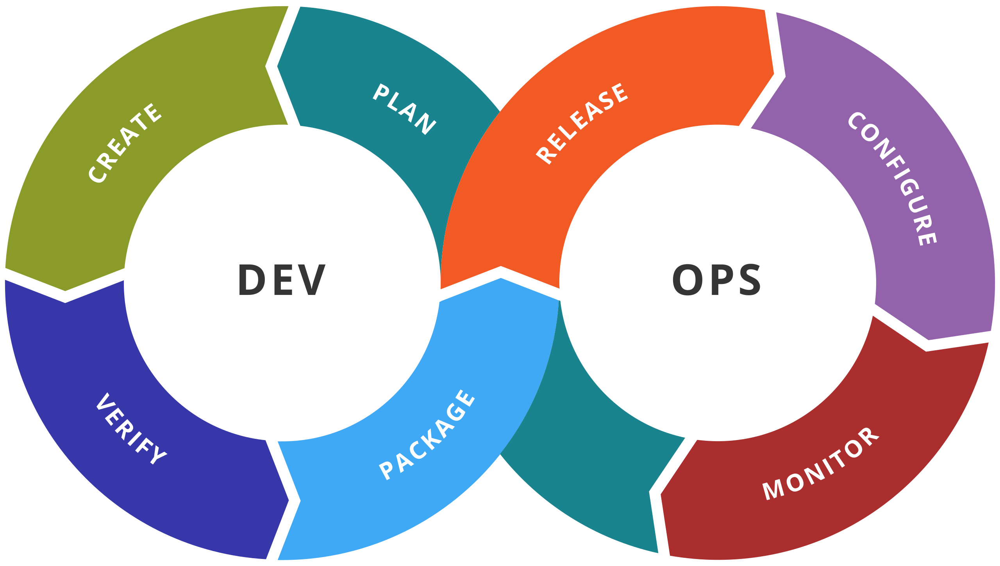

# ALTEN-DEVOPS

# Devops-Training

   

***
## ¿Qué vamos a ver?

El origen de DevOps se remonta a 2007, cuando Patrick Debois, al trabajar para el gobierno belga, notó los conflictos entre los equipos de desarrollo y operaciones. En 2008 conoció a Andrew Clay Shafer y juntos crearon el grupo **Agile System Administrators** para promover la colaboración entre ambos.

En 2009, tras la charla **“10 deploys per day”** de John Allspaw y Paul Hammond, Debois impulsó el término **DevOps** (*Development + Operations*), buscando integrar ambos equipos. Desde entonces, el enfoque DevOps se ha extendido globalmente, mejorando la eficiencia y comunicación en el desarrollo tecnológico.

***
